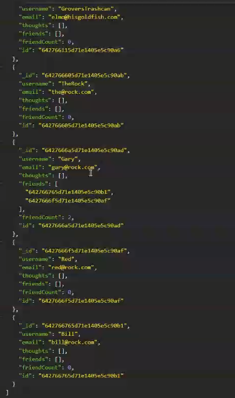

# Social Network API

This project is an Express backend API that serves as the basis for a small social network application. It stores Users, their friends, thoughts, and reactions.

## Authors

- [Dylan Freeman](https://www.github.com/templarmanatee)

## Badges

## Demo

https://watch.screencastify.com/v/d0J1pNMRR06lZTdAefzj

## Screenshots

## License

[MIT](https://choosealicense.com/licenses/mit/)

## Feedback

If you have any feedback, please reach out to me at dylan@dylanfreeman.tech
